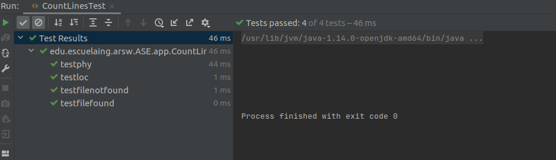

# LOC COUNTING

Este programa cuenta la cantidad de líneas de archivos phy y loc, a partir de el tipo de archivo y el nombre del archivo.

El aplicativo cuenta con 2 clases para conseguir contar las lineas de archivos dependiendo si se requiera contar "physical" o "Line of Code".

La primera clase es la clase CountLines que tiene el metodo main el cual se encarga de recibir los datos inciales como lo son la ruta de archivo y el tipo de conteo de lineas.

La segunda clase es la clase ReadFiles que usa el metodo muestraContenido que se encarga de todo el manejo de recibir el archivo y el tipo de archivo y realizar la logica para obtener las lineas de archivo

Adicional esta la clase de Test donde hay 4 test
	* Test funcionalidad para phy
	* Test funcionalidad para loc
	* Test que arroje excepcion que archivo no existe
	* Test que indique que archivo si fue encontrado 


Los pasos a continuación permiten clonar el programa en su computador.

### Prerrequisitos

Eston son los requisitos que software que tienen que estar instalados previamente:

```
Maven
```
```
Git
```
```
Java
```

## NOTA:
* Para tener en cuenta archivos de prueba se encuentran dentro de src/main/resources

## Construcción 
* [Maven](https://maven.apache.org/) - Dependencias de maven

## Autores

* **Mateo Quintero Acevedo** 

## LOC

	85 lineas en 5 horas
	17 lineas codigo por hora

## TEST
  
	
## Licencia

En este proyecto se usó la licencia GNU - se puede ver [LICENSE](LICENSE) para más detalles.


